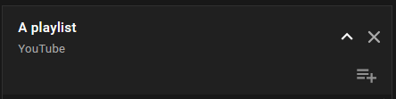

# YouTube Playlist Close Button
Javascript script to append a close button next to the expand button of YouTube playlist window to effectively "close" the playlist.


## Info
Have you ever tried to copy a link to YouTube video, that is pointing at specific time in the video, but right after pasting it you realize you also pasted the query string to a an entire playlist as well? Or perhaps you just want to see that one specific video and you don't want to play an entire playlist. Well, this simple script may help with that. For long time, the only way I would remove the playlist was to remove the query parameter.. I'm still suprised that there is no button to remove the playlist, or at least not that I know of, and simply play the current video.

To clarify what I mean, this is how the playlist panel looks like after the script is executed


This script adds another button, right next to the Expand button (arrow down). This new button has the form of a cross and its whole purpose is to close the playlist by redirecting you to the current video (with the current timestamp), but without the playlist.

## Files included
The main script is the file `script.js`. It's written in plain javascript, so you don't need any libraries for it to work. There are two main functions that are really easy to use: `CreateCloseButtonAndAppendIt(insertAfterExpandButton: boolean)` and `CloseButtonOnClickEvent()`. 
They are pretty self-explanatory, the function `CreateCloseButtonAndAppendIt` accepts one parameter of type boolean, which specifies where the button should be placed - after (true) or before (false) the expand playlist button.
The function `CloseButtonOnClickEvent` should be invoked whenever the close button is clicked.
* Example
```javascript
  let closeButton = CreateCloseButtonAndAppendIt(true);
  if (closeButton != null) {
       closeButton.addEventListener("click", CloseButtonOnClickEvent);
  }
```

However, the main purpose of this script is to be used with the help of a browser extension that can execute the script automatically, like `Greasemonkey` or `Tampermonkey`.
Which is why I included another file - `extensionScript.js`. **The script works with both extensions I've just mentioned, just paste it and it works!** The script includes the `script.js` file using jsdelivr CDN.

## Few notes
I wrote this script some time ago to quickly automate the closing process. In its current state, most of the stuff are pretty hardcoded (like design), so in the future that could definitely be changed so that you can pass design options and other stuff to the functions.
